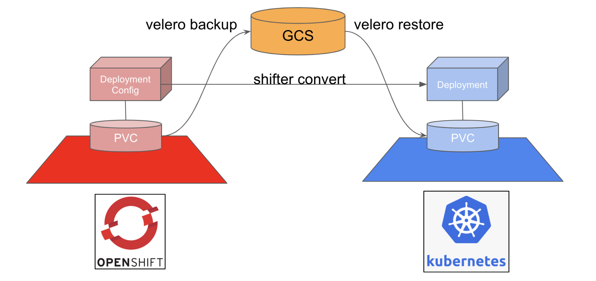

# Migrate Applications

This section further expands our migration capability to include both the persistent data and workloads. From previous sections, we learned Openshift has several propietary objects (e.g. DeploymentConfig, Route), which are different from Kubernetes. Luckily, when it comes to Persistent Data, Openshift sticks with Kubernetes standard. Therefore, we could achieve the migration with the help of Opensource data migration tools. 

In this demo, we will use [Velero](https://velero.io/) as an example. However, there are other 3rd-party tools (e.g. Kasten from Veeam) could also be used. Readers could select one which fits your work. Like our earlier work, we will [Shifter](https://github.com/garybowers/shifter) for workloads migration. Please have both Velero CLI and Shifter CLI installed onto your workstation. We'll conduct our demo in Mac OS to show our shifter tool could be used cross-platform. In fact, shifter supports [MAC/Linux/Windows starting from 0.12](https://github.com/garybowers/shifter/releases). For linux tutorial, please refer to [11.MigrateApplications](https://github.com/VeerMuchandi/MigratingFromOpenShiftToGKE/blob/main/11.MigrateApplications.md)

```
# Download shifter CLI
wget https://github.com/garybowers/shifter/releases/download/0.12/shifter_darwin_amd64
mv shifter-darwin-amd64 shifter
chmod +x shifter

# Download velero CLI
wget https://github.com/vmware-tanzu/velero/releases/download/v1.6.0/velero-v1.6.0-darwin-amd64.tar.gz
tar zxvf velero-v1.6.0-darwin-amd64.tar.gz
mv velero-v1.6.0-darwin-amd64/velero ./velero
chmod +x velero
```
Also set the PATH to access shifter or move it to a place where the PATH is already set.

We recommend conducting migration processes per namespace instead of the entire cluster. Also, a switch downtime is expected for the migration process, which normally can be minutes to hours, depending on the workload types. The following diagram provides a quick sketch for our

## Create Bucket in Google Cloud Storage
In order to utilize velero for persistent data backup/restore, the following script could create a bucket in Google Cloud Storage (GCS) and the service account to read/write to this bucket. This script also downloads the service account key as credential-velero file for the next step. 
```console
# Please replace {PROJECT_ID} and {BUCKET_NAME} with your input.
export PROJECT_ID={PROJECT_ID}
export BUCKET={BUCKET_NAME}

gsutil mb gs://$BUCKET/
gcloud iam service-accounts create velero \
    --display-name "Velero service account"

SERVICE_ACCOUNT_EMAIL=$(gcloud iam service-accounts list \
  --filter="displayName:Velero service account" \
  --format 'value(email)')

ROLE_PERMISSIONS=(
    compute.disks.get
    compute.disks.create
    compute.disks.createSnapshot
    compute.snapshots.get
    compute.snapshots.create
    compute.snapshots.useReadOnly
    compute.snapshots.delete
    compute.zones.get
)

gcloud iam roles create velero.server \
    --project $PROJECT_ID \
    --title "Velero Server" \
    --permissions "$(IFS=","; echo "${ROLE_PERMISSIONS[*]}")"

gcloud projects add-iam-policy-binding $PROJECT_ID \
    --member serviceAccount:$SERVICE_ACCOUNT_EMAIL \
    --role projects/$PROJECT_ID/roles/velero.server

gsutil iam ch serviceAccount:$SERVICE_ACCOUNT_EMAIL:objectAdmin gs://${BUCKET}
gcloud iam service-accounts keys create credentials-velero \
    --iam-account $SERVICE_ACCOUNT_EMAIL
```
## Install Velero
Next, we could use the following script to install velero in both Openshift and Kubernetes (GKE) clusters. This script has to be executed with [kubectx](https://github.com/ahmetb/kubectx/releases) and [oc](https://docs.openshift.com/container-platform/3.6/cli_reference/get_started_cli.html#installing-the-cli) commands. Please provide the kubeconfig contexts and bucket name as the input of the script.
```console
export context_src={OPENSHIFT_CONTEXT}
export context_dst={GKE_CONTEXT}
export BUCKET={BUCKET_NAME}

kubectx ${context_src}
velero install \
    --provider gcp \
    --plugins velero/velero-plugin-for-gcp:v1.1.0 \
    --bucket $BUCKET \
    --use-restic \
    --secret-file credentials-velero

./oc -n velero patch ds/restic --type json -p '[{"op":"add","path":"/spec/template/spec/containers/0/securityContext","value": { "privileged": true}}]'
./oc -n velero patch ds/restic --type json -p '[{"op":"replace","path":"/spec/template/spec/volumes/0/hostPath","value": { "path": "/var/lib/kubelet/pods"}}]'

kubectx ${context_dst}
velero install \
    --provider gcp \
    --plugins velero/velero-plugin-for-gcp:v1.1.0 \
    --bucket $BUCKET \
    --use-restic \
    --secret-file credentials-velero
```
## Annotate workloads for Velero backup
Velero uses annotation to notify Restic the volumes to backup. Since the persistent volumes were attached to each pod, it became complicated when  Velero, after version 1.5, supports both [opt-in](https://velero.io/docs/v1.5/restic/#using-opt-in-pod-volume-backup) and [opt-out](https://velero.io/docs/v1.5/restic/#using-the-opt-out-approach) mechanims for persistent volume backup. Opt-in mode does not backup any persistent volume by default but only to the pods which have the annotation. Opt-out mode would backup all persistent volumes (except for secrets/configmaps and hostpath volumes) by default. Pods requires to be annotated to have its volume being excluded.

In this demo, we choose opt-out since we intended to backup all persistent volumes in the desired namespace. By adding "--default-volumes-to-restic" in the backup command could easily activate the opt-out mode. Compared with the opt-in mode which requires additional annotations, opt-out mode provides an easier way for existing openshift data migration.

## Converting Manifests
We took a similar approach as shown in [11.MigrateApplications#converting-manifests](https://github.com/VeerMuchandi/MigratingFromOpenShiftToGKE/blob/main/11.MigrateApplications.md#converting-manifests) to capture openshift objects into YAML format and stored in ocp-manifests/ folder. Then, shifter is applied to convert those openshift objects into standard kubernetes object yaml files and stored in kubernetes-manifests/ folder (shown in the last step).

```
export ns=${WORKLOAD_NAMESPACE}

# Capture workload
for dc in $(./oc get dc -n $ns -o jsonpath='{.items[*].metadata.name}' ); do
  echo "Exporting DeploymentConfigs: " $dc;
  ./oc get dc $dc -n $ns -o yaml \
    | yq e 'del(.metadata.creationTimestamp)' - \
    | yq e 'del(.metadata.annotations.*)' - \
    | yq e 'del(.metadata.labels.template*)' - \
    | yq e 'del(.metadata.labels.xpaas)' - \
    | yq e 'del(.metadata.resourceVersion)' - \
    | yq e 'del(.metadata.selfLink)' - \
    | yq e 'del(.metadata.uid)' - \
    | yq e 'del(.metadata.generation)' - \
    | yq e 'del(.metadata.managedFields)' - \
    | yq e 'del(.status)' -  \
    > ocp-manifests/namespaces/$ns/$dc-dc.yaml;
done

for route in $(./oc get route -n $ns -o jsonpath='{.items[*].metadata.name}' ); do
  echo "Exporting Route: " $route;
  ./oc get route $route -n $ns -o yaml \
    | yq e 'del(.metadata.creationTimestamp)' - \
    | yq e 'del(.metadata.annotations.*)' - \
    | yq e 'del(.metadata.labels.template*)' - \
    | yq e 'del(.metadata.labels.xpaas)' - \
    | yq e 'del(.metadata.resourceVersion)' - \
    | yq e 'del(.metadata.selfLink)' - \
    | yq e 'del(.metadata.managedFields)' - \
    | yq e 'del(.metadata.uid)' - \
    | yq e 'del(.status)' - \
    > ocp-manifests/namespaces/$ns/$route-route.yaml
done

#imagestreams
for is in $(./oc get is -n $ns -o jsonpath='{.items[*].metadata.name}' ); do
    echo "Exporting ImageStreams: " $is;
    ./oc get is $is -n $ns -o yaml \
        | yq e 'del(.metadata.creationTimestamp)' - \
        | yq e 'del(.metadata.annotations.*)' - \
        | yq e 'del(.metadata.resourceVersion)' - \
        | yq e 'del(.metadata.selfLink)' - \
        | yq e 'del(.metadata.generation)' - \
        | yq e 'del(.metadata.uid)' - \
        > ocp-manifests/namespaces/$ns/$is-is.yaml
done;

#services
for service in $(./oc get service -n $ns -o jsonpath='{.items[*].metadata.name}' ); do
    echo "Exporting service: " $service;
    ./oc get svc $service -n $ns -o yaml \
        | yq e 'del(.metadata.creationTimestamp)' - \
        | yq e 'del(.metadata.annotations.*)' - \
        | yq e 'del(.metadata.labels.template*)' - \
        | yq e 'del(.metadata.labels.xpaas)' - \
        | yq e 'del(.metadata.resourceVersion)' - \
        | yq e 'del(.metadata.selfLink)' - \
        | yq e 'del(.metadata.uid)' - \
        | yq e 'del(.metadata.managedFields)' - \
        | yq e 'del(.status)' -  \
        | yq e 'del(.spec.clusterIP)' -  \
        | yq e 'del(.spec.clusterIPs)' -  \
        > ocp-manifests/namespaces/$ns/$service-service.yaml
done;
./shifter convert -f ./ocp-manifests/namespaces/$ns -t yaml -o ./kubernetes-manifests/namespaces/$ns
```
## Select workloads for Velero Backup
Velero, by default, does not only backup persistent volume but also standard kubernetes objects (e.g. pods, services, config maps). Those components are included in deployment objects, converted by shifter in previous step. We therefore will adapt labelling techniques, provided by Velero. By properly label the PersistentVolume and PersistentVolumeClaim, we could successfully backup data without other kubernetes objects. The following script provides an example. 

```
export pvc_name={DESIRED_PVC_NAME}
# label format is 'key=value'
export mylabel={DESIRED_LABEL}

./oc label pvc ${pvc_name} ${mylabel}
my_pv=$(./oc get pv | grep ${pvc_name} | awk '{print $1}')
./oc label pv ${my_pv} ${mylabel}

velero backup create select-backup --selector ${mylabel} --default-volumes-to-restic
```
## Activate Migrated Workloads
Finally, we will activate the entire workloads. Let's first switch to the kubernetes cluster and use "velero backup get" to ensure the backup is successful. Note the the status of the backup success could be delay in target cluster compared with the source cluster. Once the backup is completed, by running the following two commands, we could have the entire workloads up-and-running in target cluster.
```
velero restore create ${restore-name} --from-backup ${backup-name}
```
Once the pv and pvc are ready, we could quickly run
```
export ns={WORKLOAD_NAMESPACE}
kubectl apply -f kubernetes-manifests/namespace/$ns/
```

To better demonstrate the steps above, an openshift workload has been prepared in [samples folder](https://github.com/GoogleCloudPlatform/migratingfromopenshifttoanthos/tree/main/samples). To use this sample, please modify envs.sh according to your environment. Then, run the scripts in the numerical order. 